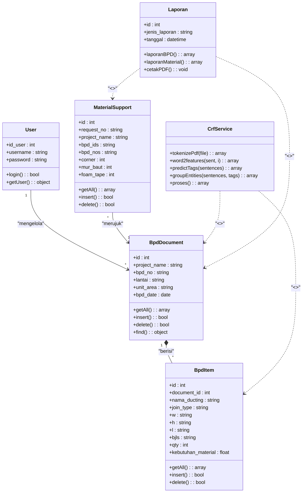

# Class Diagram - Sistem Ekstraksi Informasi Dokumen Fabrikasi Ducting Berbasis CRF

Dokumen ini berisi Class Diagram sistem yang disesuaikan dengan pola arsitektur yang Anda berikan, mencakup entitas data (dengan method CRUD standar) serta komponen pemrosesan ekstraksi CRF dan pelaporan.

---

## Deskripsi Relasi
- **User** ke **BpdDocument (`1` ke `*`)**: Satu user dapat mengelola atau mengunggah banyak dokumen BPD (Directed Association).
- **BpdDocument** ke **BpdItem (`1` ke `*`)**: Satu dokumen BPD terdiri atas banyak item detail ducting (Composition).
- **MaterialSupport** ke **BpdDocument (`*` ke `1`)**: Satu atau beberapa pengajuan material support merujuk pada dokumen BPD yang bersangkutan (Directed Association).
- **CrfService** ke **BpdDocument / BpdItem (`<<create>>`)**: Layanan ekstraksi CRF bertugas untuk memproses PDF dan menginstansiasi/membuat (`create`) entitas data BPD & BpdItem baru (Dependency).
- **Laporan** ke **Entitas (`<<use>>`)**: Kelas laporan menggunakan (`use`) data BPD dan Material Support untuk digenerate menjadi bentuk PDF/cetak (Dependency).
