# Activity Diagram - Mengelola Data BPD (Kelola BPD)

Dokumen ini berisi Activity Diagram untuk proses **Mengelola Data BPD** (BPD Management) pada sistem, yang dimodelkan menggunakan format dua swimlane: **Admin** (Pengguna) dan **Sistem**. Bagian tambah/upload data BPD diabaikan karena sudah dimodelkan dalam dokumen terpisah.

```mermaid
graph TD
    %% --- Subgraph untuk Swimlane Admin ---
    subgraph Admin ["Admin"]
        StartNode(( ))
        A1["Membuka menu kelola BPD"]
        A2["Memilih aksi"]
        
        %% Cabang CARI / FILTER
        A_Filter1["Memilih kriteria filter <br>(Proyek, Tanggal Mulai/Selesai)"]
        
        %% Cabang LIHAT DETAIL
        A_Detail1["Memilih data BPD & <br>klik tombol Lihat Detail"]
        
        %% Cabang HAPUS
        A_Delete1["Memilih data BPD & <br>klik tombol Hapus"]
    end

    %% --- Subgraph untuk Swimlane Sistem ---
    subgraph Sistem ["Sistem"]
        S1["Tampilkan halaman kelola BPD <br>(Daftar Dokumen BPD)"]
        DecideAction{"Pilih aksi?"}
        
        %% Alur CARI / FILTER
        S_Filter1["Memproses query filter <br>pada database"]
        
        %% Alur LIHAT DETAIL
        S_Detail1["Mengambil data detail & <br>kalkulasi BJLS dari database"]
        S_Detail2["Menampilkan halaman detail BPD"]
        
        %% Alur HAPUS
        S_Delete1["Memproses penghapusan data <br>BPD (Cascade ke BpdItem)"]
        
        %% Penggabungan Alur (Merge)
        MergeNode{ }
        S_ListUpdated["Menampilkan daftar BPD terbaru"]
        EndNode((( )))
    end

    %% --- Alur Relasi & Koneksi ---
    StartNode --> A1
    A1 --> S1
    S1 --> A2
    A2 --> DecideAction

    %% Koneksi Cabang CARI / FILTER
    DecideAction -- "CARI / FILTER" --> A_Filter1
    A_Filter1 --> S_Filter1
    S_Filter1 --> MergeNode

    %% Koneksi Cabang LIHAT DETAIL
    DecideAction -- "LIHAT DETAIL" --> A_Detail1
    A_Detail1 --> S_Detail1
    S_Detail1 --> S_Detail2
    S_Detail2 --> EndNode

    %% Koneksi Cabang HAPUS
    DecideAction -- "HAPUS" --> A_Delete1
    A_Delete1 --> S_Delete1
    S_Delete1 --> MergeNode

    %% Koneksi setelah Merge
    MergeNode --> S_ListUpdated
    S_ListUpdated --> EndNode

    %% --- Styling Node ---
    style StartNode fill:#000,stroke:#333,stroke-width:2px;
    style EndNode fill:#000,stroke:#333,stroke-width:4px;
    style MergeNode fill:#fff,stroke:#333,stroke-width:1px;
```

---

## Deskripsi Alur Aktivitas (Activity Flow)

1. **Membuka Menu Kelola BPD**: Aktivitas dimulai di sisi **Admin** dengan membuka menu kelola BPD. **Sistem** kemudian menampilkan halaman kelola BPD yang berisi daftar dokumen BPD yang terdaftar di database.
2. **Memilih Aksi**: Admin memilih aksi yang ingin dilakukan. Sistem mengevaluasi aksi tersebut melalui percabangan keputusan (*Decision Node*):
   - **Aksi CARI / FILTER**:
     - Admin memilih filter berdasarkan Nama Proyek atau Rentang Tanggal Mulai dan Tanggal Selesai.
     - Sistem memproses kriteria pencarian terfilter ke database.
     - Alur ini dilanjutkan ke pembaruan daftar data yang ditampilkan.
   - **Aksi LIHAT DETAIL**:
     - Admin memilih dokumen BPD tertentu dan mengklik ikon "Lihat Detail".
     - Sistem mengambil data spesifik dokumen beserta detail kalkulasi BJLS dari database.
     - Sistem menampilkan halaman detail BPD terpisah (mengakhiri alur ini).
   - **Aksi HAPUS**:
     - Admin memilih dokumen BPD dan mengklik tombol hapus (mengonfirmasi popup).
     - Sistem melakukan proses penghapusan data secara berantai (*cascade delete*) pada database MySQL untuk dokumen terpilih dan semua item ducting-nya.
     - Alur ini dilanjutkan ke pembaruan daftar data yang ditampilkan.
3. **Pembaruan Daftar BPD**: Alur aksi **CARI / FILTER** dan **HAPUS** digabungkan kembali (*merge node*) ke sistem untuk memperbarui daftar data yang ditampilkan.
4. **End**: Proses pengelolaan selesai dan kembali menampilkan daftar BPD yang ter-update.
