# Activity Diagram - Mengelola Data Material Support (Kelola Material Support)

Dokumen ini berisi Activity Diagram untuk proses **Mengelola Data Material Support** pada sistem, yang dimodelkan menggunakan format dua swimlane: **Admin** (Pengguna) dan **Sistem**. Alur penambahan (TAMBAH) permintaan material support diabaikan dari diagram ini karena sudah dibahas secara terpisah.

```mermaid
graph TD
    %% --- Subgraph untuk Swimlane Admin ---
    subgraph Admin ["Admin"]
        StartNode(( ))
        A1["Membuka menu Material Support"]
        A2["Memilih aksi"]
        
        %% Cabang CARI / FILTER
        A_Filter1["Memilih kriteria filter <br>(Proyek, Rentang Tanggal)"]
        
        %% Cabang LIHAT DETAIL
        A_Detail1["Memilih data & klik Lihat Detail"]
        
        %% Cabang LAPORAN BULANAN
        A_Report1["Klik tombol Laporan Bulanan"]
        
        %% Cabang HAPUS
        A_Delete1["Memilih data & klik Hapus"]
    end

    %% --- Subgraph untuk Swimlane Sistem ---
    subgraph Sistem ["Sistem"]
        S1["Tampilkan halaman Material Support <br>(Daftar Permintaan)"]
        DecideAction{"Pilih aksi?"}
        
        %% Alur CARI / FILTER
        S_Filter1["Memproses query filter <br>pada database"]
        
        %% Alur LIHAT DETAIL
        S_Detail1["Mengambil data detail & <br>kalkulasi komponen dari database"]
        S_Detail2["Menampilkan halaman detail <br>Material Support"]
        
        %% Alur LAPORAN BULANAN
        S_Report1["Mengambil & mengagregasi data <br>kebutuhan material support per proyek"]
        S_Report2["Menampilkan halaman laporan <br>bulanan material support"]
        
        %% Alur HAPUS
        S_Delete1["Menghapus data permintaan <br>Material Support dari database"]
        
        %% Penggabungan Alur (Merge)
        MergeNode{ }
        S_ListUpdated["Menampilkan daftar Material Support terbaru"]
        EndNode((( )))
    end

    %% --- Alur Relasi & Koneksi ---
    StartNode --> A1
    A1 --> S1
    S1 --> A2
    A2 --> DecideAction

    %% Koneksi Cabang CARI / FILTER
    DecideAction -- "CARI / FILTER" --> A_Filter1
    A_Filter1 --> S_Filter1
    S_Filter1 --> MergeNode

    %% Koneksi Cabang LIHAT DETAIL
    DecideAction -- "LIHAT DETAIL" --> A_Detail1
    A_Detail1 --> S_Detail1
    S_Detail1 --> S_Detail2
    S_Detail2 --> EndNode

    %% Koneksi Cabang LAPORAN BULANAN
    DecideAction -- "LAPORAN BULANAN" --> A_Report1
    A_Report1 --> S_Report1
    S_Report1 --> S_Report2
    S_Report2 --> EndNode

    %% Koneksi Cabang HAPUS
    DecideAction -- "HAPUS" --> A_Delete1
    A_Delete1 --> S_Delete1
    S_Delete1 --> MergeNode

    %% Koneksi setelah Merge
    MergeNode --> S_ListUpdated
    S_ListUpdated --> EndNode

    %% --- Styling Node ---
    style StartNode fill:#000,stroke:#333,stroke-width:2px;
    style EndNode fill:#000,stroke:#333,stroke-width:4px;
    style MergeNode fill:#fff,stroke:#333,stroke-width:1px;
```

---

## Deskripsi Alur Aktivitas (Activity Flow)

1. **Membuka Menu Material Support**: Aktivitas dimulai di sisi **Admin** dengan membuka menu Material Support. **Sistem** kemudian menampilkan halaman kelola yang berisi daftar permintaan material support yang sudah tersimpan di database.
2. **Memilih Aksi**: Admin memilih aksi yang ingin dilakukan. Sistem mengevaluasi aksi tersebut melalui percabangan keputusan (*Decision Node*):
   - **Aksi CARI / FILTER**:
     - Admin memilih filter berdasarkan proyek atau rentang tanggal.
     - Sistem memproses pencarian terfilter ke database.
     - Alur ini dilanjutkan ke pembaruan daftar data yang ditampilkan.
   - **Aksi LIHAT DETAIL**:
     - Admin memilih data tertentu dan mengklik "Lihat Detail".
     - Sistem mengambil rincian data dan menghitung kebutuhan per BPD dari database.
     - Sistem menampilkan halaman detail material support (mengakhiri alur ini).
   - **Aksi LAPORAN BULANAN**:
     - Admin mengklik tombol "Laporan Bulanan" (bisa difilter proyek & tanggal).
     - Sistem mengambil dan mengagregasi data total kebutuhan (Corner, Mur Baut, Foam Tape) per proyek dari database.
     - Sistem menyajikan halaman laporan bulanan pemakaian material support terintegrasi (mengakhiri alur ini).
   - **Aksi HAPUS**:
     - Admin memilih data dan mengklik "Hapus".
     - Sistem menghapus data permintaan tersebut dari database.
     - Alur ini dilanjutkan ke pembaruan daftar data yang ditampilkan.
3. **Pembaruan Daftar & End**: Aksi **CARI / FILTER** dan **HAPUS** digabungkan kembali (*merge node*) ke sistem untuk memperbarui daftar data yang ditayangkan, lalu aktivitas selesai.
