# Activity Diagram - Proses Login

Dokumen ini berisi Activity Diagram untuk proses **Login Pengguna** pada sistem, yang dimodelkan menggunakan format dua swimlane: **Admin** (Pengguna) dan **Sistem**.

```mermaid
graph TD
    %% --- Subgraph untuk Swimlane Admin ---
    subgraph Admin ["Admin"]
        StartNode(( ))
        A1["Membuka aplikasi"]
        A2["Masuk ke halaman login"]
        A3["Memasukan Username dan Password"]
    end

    %% --- Subgraph untuk Swimlane Sistem ---
    subgraph Sistem ["Sistem"]
        S1["Cek validasi admin"]
        Decide{"Username dan
        Password benar?"}
        S2["Tampilkan pesan error"]
        S3["Tampilkan halaman Dashboard (Home)"]
        EndNode((( )))
    end

    %% --- Alur Relasi & Koneksi ---
    StartNode --> A1
    A1 --> A2
    A2 --> A3
    A3 --> S1
    S1 --> Decide
    
    Decide -- "Tidak" --> S2
    S2 --> A2
    
    Decide -- "Ya" --> S3
    S3 --> EndNode

    %% --- Styling Node ---
    style StartNode fill:#000,stroke:#333,stroke-width:2px;
    style EndNode fill:#000,stroke:#333,stroke-width:4px;
```

---

## Deskripsi Alur Aktivitas (Activity Flow)

1. **Start**: Aktivitas dimulai di sisi **Admin** dengan membuka aplikasi.
2. **Halaman Login**: Admin masuk ke Halaman Login dan memasukkan data kredensial berupa *Username* dan *Password*.
3. **Validasi**: Data dikirimkan ke **Sistem** untuk dilakukan proses validasi kredensial.
4. **Percabangan (Decision)**:
   - Jika **Username dan Password benar? = Tidak**: Sistem akan menampilkan pesan error, lalu mengembalikan Admin ke halaman login untuk mengisi kembali kredensial.
   - Jika **Username dan Password benar? = Ya**: Sistem mengizinkan akses dan menampilkan halaman utama (Dashboard / Home).
5. **End**: Proses login selesai.
