# Activity Diagram - Proses Tambah Material Support

Dokumen ini berisi Activity Diagram untuk proses **Tambah/Buat Permintaan Material Support** pada sistem, yang dimodelkan menggunakan format dua swimlane: **Admin** (Pengguna) dan **Sistem**.

```mermaid
graph TD
    %% --- Subgraph untuk Swimlane Admin ---
    subgraph Admin ["Admin"]
        StartNode(( ))
        A1["Membuka Halaman Tambah Material Support"]
        A2["Memilih Nama Proyek"]
        A3["Memilih Dokumen BPD dari Daftar <br>(Checklist Satu/Beberapa BPD)"]
        A4["Klik Tombol Hitung Kebutuhan"]
        A5["Meninjau Hasil Kalkulasi & Rincian"]
        A6["Klik Tombol Simpan Permintaan"]
        A7["Batal / Cancel Pembuatan"]
    end

    %% --- Subgraph untuk Swimlane Sistem ---
    subgraph Sistem ["Sistem"]
        S1["Tampilkan Form Tambah Material Support"]
        S2["Query Dokumen BPD Berdasarkan Proyek"]
        S3["Tampilkan Daftar Checklist BPD Terkait"]
        S4["Hitung Kebutuhan Material Support <br>(Total Corner, Mur Baut, Foam Tape)"]
        S5["Tampilkan Pratinjau Metrik & Tabel Rincian"]
        S6["Validasi Input Data Permintaan"]
        DecideValid{"Data Valid?"}
        S7["Tampilkan Pesan Error"]
        S8["Generasi Request No Baru <br>(Sequential, e.g. 1/VII/26)"]
        S9["Simpan Permintaan ke Database <br>(Tabel material_supports)"]
        S10["Tampilkan Pesan Sukses & <br>Kembalikan ke Daftar Utama"]
        EndNode((( )))
    end

    %% --- Alur Relasi & Koneksi ---
    StartNode --> A1
    A1 --> S1
    S1 --> A2
    A2 --> S2
    S2 --> S3
    S3 --> A3
    A3 --> A4
    A4 --> S4
    S4 --> S5
    S5 --> A5
    A5 --> A6
    A6 --> S6
    S6 --> DecideValid
    
    DecideValid -- "Tidak" --> S7
    S7 --> A5
    
    DecideValid -- "Ya" --> S8
    S8 --> S9
    S9 --> S10
    S10 --> EndNode
    
    A7 --> EndNode
    
    %% --- Styling Node ---
    style StartNode fill:#000,stroke:#333,stroke-width:2px;
    style EndNode fill:#000,stroke:#333,stroke-width:4px;
```

---

## Deskripsi Alur Aktivitas (Activity Flow)

1. **Start**: Admin membuka menu tambah permintaan Material Support.
2. **Tampilkan Halaman**: Sistem menyajikan form tambah permintaan baru.
3. **Pilih Proyek**: Admin memilih proyek pada dropdown menu. Sistem mendeteksi pilihan tersebut, lalu memproses query database untuk menarik daftar BPD yang terasosiasi dengan proyek tersebut.
4. **Pilih BPD & Hitung**:
   - Sistem menampilkan checklist berisi nomor-nomor BPD pada proyek terkait.
   - Admin memilih satu atau beberapa BPD, kemudian mengklik tombol **Hitung Kebutuhan**.
   - Sistem melakukan kalkulasi kebutuhan material support (Corner, Mur Baut, Foam Tape) berdasarkan ukuran dan tipe sambungan TFD yang ada di detail item BPD terpilih (`calculate_material_support_for_bpds`).
   - Sistem menampilkan pratinjau ringkasan metrik dan tabel rincian item.
5. **Simpan Permintaan**:
   - Admin meninjau data hasil kalkulasi, lalu menekan tombol **Simpan Permintaan**.
   - Sistem memvalidasi kelengkapan data. Jika tidak valid, sistem menampilkan error. Jika valid, sistem membuat nomor urut permintaan baru (`get_next_support_request_no`), menyimpannya ke tabel `material_supports`, menampilkan notifikasi sukses, dan mengalihkan Admin kembali ke halaman utama.
6. **End**: Proses tambah material support selesai.
