# Activity Diagram - Proses Upload BPD

Dokumen ini berisi Activity Diagram untuk proses **Upload BPD** pada sistem, yang dimodelkan menggunakan format dua swimlane: **Admin** (Pengguna) dan **Sistem**. Proses ini mencakup pengunggahan dokumen PDF, tokenisasi, klasifikasi entitas dengan model CRF (Conditional Random Fields), verifikasi data oleh Admin, kalkulasi kebutuhan material secara otomatis, hingga penyimpanan data ke database.

```mermaid
graph TD
    %% --- Subgraph untuk Swimlane Admin ---
    subgraph Admin ["Admin"]
        StartNode(( ))
        A1["Membuka Halaman Upload BPD"]
        A2["Memilih File PDF Dokumen BPD <br>(File Picker / Drag & Drop)"]
        A3["Verifikasi & Edit Data Ekstraksi <br>(Project Name, BPD No, Lantai, Unit, Detail Item)"]
        A4["Klik Tombol Save & Konfirmasi"]
        A5["Cancel / Reset Form"]
    end

    %% --- Subgraph untuk Swimlane Sistem ---
    subgraph Sistem ["Sistem"]
        S1["Cek Format File (Apakah PDF?)"]
        DecidePDF{"Valid PDF?"}
        
        S2["Tokenisasi & Ekstraksi Teks (pdfplumber)"]
        S3["Cek Kata Kunci 'BPD' dalam Dokumen"]
        DecideBPD{"Mengandung Kata 'BPD'?"}
        
        S4["Prediksi Labeled Tokens (Model CRF)"]
        S5["Group Labeled Tokens menjadi Entitas"]
        S6["Restrukturisasi Data (Header & Detail Item)"]
        S7["Tampilkan Data Hasil Ekstraksi ke Form & Tabel"]
        
        S8["Kalkulasi Kebutuhan Material per Item Ducting"]
        S9["Simpan Data ke Database (BpdDocument & BpdItem)"]
        S10["Tampilkan Notifikasi Sukses"]
        S11["Tampilkan Pesan Error"]
        EndNode((( )))
    end

    %% --- Alur Relasi & Koneksi ---
    StartNode --> A1
    A1 --> A2
    A2 --> S1
    S1 --> DecidePDF
    
    DecidePDF -- "Tidak" --> S11
    DecidePDF -- "Ya" --> S2
    
    S2 --> S3
    S3 --> DecideBPD
    
    DecideBPD -- "Tidak" --> S11
    DecideBPD -- "Ya" --> S4
    
    S4 --> S5
    S5 --> S6
    S6 --> S7
    
    S7 --> A3
    A3 --> A4
    
    A4 --> S8
    S8 --> S9
    S9 --> S10
    S10 --> EndNode
    
    S11 --> A1
    A5 --> A1
    
    %% --- Styling Node ---
    style StartNode fill:#000,stroke:#333,stroke-width:2px;
    style EndNode fill:#000,stroke:#333,stroke-width:4px;
```

---

## Deskripsi Alur Aktivitas (Activity Flow)

1. **Start**: Aktivitas dimulai oleh **Admin** dengan mengakses halaman **Upload BPD** pada aplikasi.
2. **Unggah Berkas**: Admin memilih dokumen PDF BPD melalui pemilih file (file picker) atau menyeretnya (drag & drop) ke drop zone.
3. **Validasi Berkas (Sistem)**:
   - Sistem memeriksa ekstensi berkas. Jika bukan PDF, sistem memicu pesan kesalahan dan meminta berkas ulang.
   - Sistem mengekstrak teks menggunakan `pdfplumber` (`tokenize_pdf`).
   - Sistem memverifikasi konten untuk memastikan kata kunci "BPD" ada di dalam dokumen. Jika tidak ditemukan, sistem menampilkan pesan error (Format Tidak Sesuai).
4. **Pemrosesan Machine Learning (Sistem)**:
   - Sistem memproses urutan token menggunakan model **CRF** yang dimuat (`predict_tags`).
   - Mengelompokkan hasil tag BIO menjadi entitas penting seperti `PROYEK`, `LANTAI`, `UNIT`, `BPD`, `ITEM`, `JOIN`, `DIM`, `THICK`, dan `QTY`.
   - Merestrukturisasi entitas tersebut menjadi objek JSON yang terstruktur (header BPD dan baris item detail).
5. **Verifikasi Data**:
   - Hasil ekstraksi otomatis ditampilkan pada form header dan tabel baris detail di halaman browser Admin.
   - Admin memeriksa kebenaran data dan dapat langsung mengedit nilai di input/select jika terdapat kesalahan pembacaan OCR/CRF, atau menghapus item yang tidak diinginkan.
6. **Penyimpanan & Kalkulasi**:
   - Admin mengonfirmasi penyimpanan dengan mengeklik tombol **Save**.
   - Sistem menerima payload JSON dan menghitung kebutuhan material (`calculate_material`) untuk setiap baris item berdasarkan dimensi (W, H, L), tipe sambungan (join type), jumlah (qty), dan ketebalan (BJLS).
   - Data header disimpan ke tabel `bpd_documents` dan detail item beserta hasil kalkulasi materialnya disimpan ke tabel `bpd_items`.
7. **End**: Sistem menampilkan pesan sukses ("BPD berhasil disimpan") dan mereset form upload. Aktivitas selesai.
