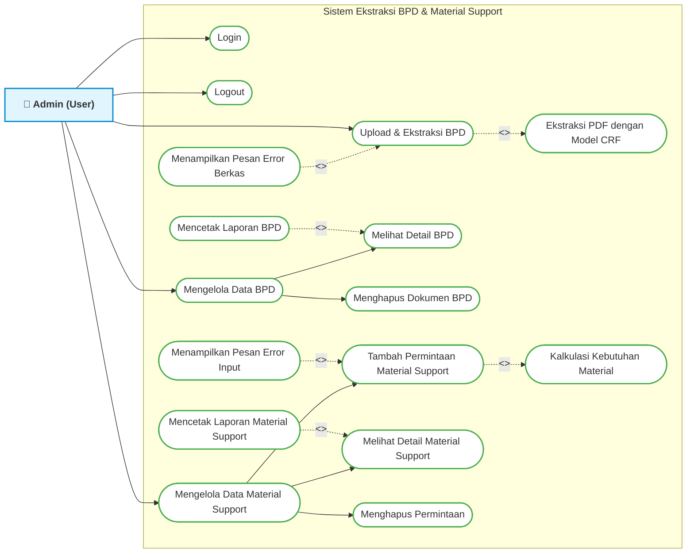

# Use Case Diagram - Sistem Ekstraksi Informasi Dokumen Fabrikasi Ducting Berbasis CRF

Dokumen ini menyajikan **Use Case Diagram** untuk sistem aplikasi. Diagram ini mendefinisikan batasan sistem (system boundary), aktor yang terlibat, serta fungsionalitas utama sistem beserta relasi `<<include>>` dan `<<extend>>`.

## Diagram

---

## Deskripsi Use Case

### 1. Utama & Autentikasi
- **Login**: Aktor (Admin) masuk ke sistem menggunakan kredensial username dan password untuk mengamankan hak akses.
- **Logout**: Aktor keluar dari sesi sistem untuk mengakhiri akses keamanan.

### 2. Pengelolaan Dokumen BPD
- **Mengelola Data BPD**: Induk use case bagi Admin untuk mencari, memfilter, dan melihat seluruh daftar berkas BPD yang telah tersimpan.
- **Upload & Ekstraksi BPD**: Admin mengunggah berkas PDF BPD untuk dikonversi menjadi data terstruktur.
  - **`<<include>>` Ekstraksi PDF dengan Model CRF**: Sistem secara otomatis memproses klasifikasi teks menggunakan algoritma Conditional Random Fields (CRF).
  - **`<<extend>>` Menampilkan Pesan Error Berkas**: Terjadi jika format berkas yang diunggah tidak valid atau bukan berkas BPD yang dikenali.
- **Melihat Detail BPD**: Admin menampilkan rincian data BPD beserta detail item ducting terdaftar.
  - **`<<extend>>` Mencetak Laporan BPD**: Admin dapat mengekspor atau mencetak hasil laporan BPD dalam bentuk cetakan/PDF dari halaman detail.
- **Menghapus Dokumen BPD**: Admin menghapus data BPD beserta seluruh item ducting yang bersangkutan dari database.

### 3. Pengelolaan Material Support
- **Mengelola Data Material Support**: Induk use case bagi Admin untuk memantau daftar permintaan material support per proyek.
- **Tambah Permintaan Material Support**: Admin membuat pengajuan kebutuhan material support (seperti Corner, Mur Baut, dan Foam Tape) baru dengan memilih referensi dokumen BPD.
  - **`<<include>>` Kalkulasi Kebutuhan Material**: Sistem secara otomatis menghitung estimasi jumlah material support berdasarkan rumus ukuran (W, H, L) dan qty item ducting pada dokumen BPD yang dipilih.
  - **`<<extend>>` Menampilkan Pesan Error Input**: Terjadi jika Admin belum memilih proyek, belum mencentang BPD, atau data tanggal pengiriman kosong saat pengisian form.
- **Melihat Detail Material Support**: Admin menampilkan detail perhitungan metrik kebutuhan material support untuk proyek tertentu.
  - **`<<extend>>` Mencetak Laporan Material Support**: Admin mengunduh / mencetak laporan kebutuhan material support.
- **Menghapus Permintaan**: Admin membatalkan atau menghapus catatan permintaan material support dari database.
